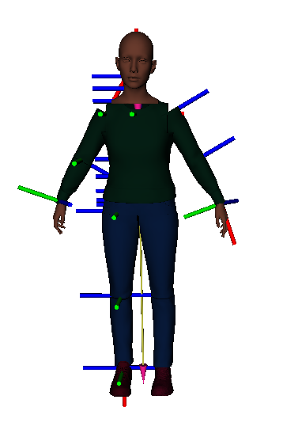

# iai_avatar_description

This package contains the kinematic and visual description of an human avatar based on the UE MetaHuman

## Launching

launch `roslaunch iai_avatar_description avatar.launch`